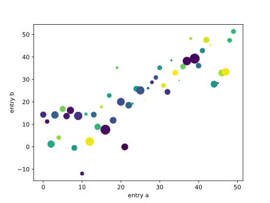

# Output modes

The widget supports different output modes:

-   [Plain text](#plain-text)
-   [SVG images](#svg-images)
-   [HTML fragments](#html-fragments)
-   [Interactive DOM](#interactive-dom)
-   [Existing DOM elements](#existing-dom-elements)

## Plain text

By default, the widget displays the printed output as text.

Widget:

```html
<codapi-snippet sandbox="python"></codapi-snippet>
```

Code snippet:

```python
def greet(name):
    print(f"Hello, {name}!")

greet("World")
```

Output:

```
Hello, World!
```

## SVG images

To display an image, set the `output-mode` attribute to `svg` and print the image as an SVG string from your code snippet.

Widget:

```html
<codapi-snippet sandbox="python" output-mode="svg"></codapi-snippet>
```

Code snippet (using `matplotlib`):

```python
import io
import numpy as np
import matplotlib.pyplot as plt

data = {"a": np.arange(50), "c": np.random.randint(0, 50, 50), "d": np.random.randn(50)}
data["b"] = data["a"] + 10 * np.random.randn(50)
data["d"] = np.abs(data["d"]) * 100

plt.scatter("a", "b", c="c", s="d", data=data)
plt.xlabel("entry a")
plt.ylabel("entry b")
plt.show()

stream = io.StringIO()
plt.savefig(stream, format="svg")
print(stream.getvalue())
```

Output:



## HTML fragments

To display HTML content, set the `output-mode` attribute to `html` and print an HTML string from your code snippet.

Widget:

```html
<codapi-snippet sandbox="python" output-mode="html"></codapi-snippet>
```

Code snippet:

```python
html = """<blockquote>
    I am <em>so</em> <strong>excited</strong>!
</blockquote>"""
print(html)
```

Output:

> I am _so_ **excited**!

You can use any HTML markup except `script`.

## Interactive DOM

When using the JavaScript playground (`engine`=`browser`, `sandbox`=`javascript`), you can render a DOM node as an output. To do so, set the `output-mode` attribute to `dom` and return a DOM node from your code snippet.

Widget:

```html
<codapi-snippet engine="browser" sandbox="javascript" output-mode="dom">
</codapi-snippet>
```

Code snippet (using [Chart.js](https://www.chartjs.org/)):

```js
const el = document.createElement("canvas");

new Chart(el, {
    type: "bar",
    data: {
        labels: ["Red", "Blue", "Yellow", "Green", "Purple", "Orange"],
        datasets: [
            {
                label: "# of Votes",
                data: [12, 19, 3, 5, 2, 3],
                borderWidth: 1,
            },
        ],
    },
});

return el;
```

Output:


## Existing DOM elements

You can use an existing DOM element for output. To do so, set the `output-mode` attribute to `hidden` and use an existing DOM node from your code snippet.

Widget:

```html
<codapi-snippet engine="browser" sandbox="javascript" output-mode="hidden">
</codapi-snippet>
```

Code snippet:

```js
const out = document.querySelector("#output");
out.innerHTML = "";

const btn = document.createElement("button");
btn.setAttribute("type", "button");
btn.innerText = "Greet me!";
btn.addEventListener("click", (event) => {
    event.target.parentElement.innerText = "Hello, World!";
});

out.appendChild(btn);
```

Output: "Greet me!" button that changes to "Hello, World!" text when clicked.

```
┌───────────┐
│ Greet me! │
└───────────┘
```

↓ click

```
Hello, World!
```
